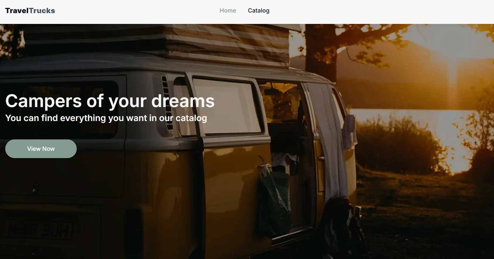

# 🚐 TravelTrucks

<p align="center">
  
</p>

---

## 📖 Про проєкт

**🌐Live Page:** [Переглянути проєкт](https://travel-trucks-three-nu.vercel.app/)

**TravelTrucks** — це вебзастосунок для пошуку та оренди кемперів для подорожей. Користувач може переглядати каталог доступних кемперів, використовувати фільтри для пошуку потрібного варіанту, відкривати детальну інформацію про кожен кемпер, переглядати галерею фотографій, характеристики та відгуки, а також залишати заявку на бронювання.


---

## ✨ Основний функціонал

**🏠 Головна сторінка**
- Знайомство з сервісом TravelTrucks.
- Навігація до каталогу кемперів.

**🚐 Каталог кемперів**
- Перегляд доступних кемперів.
- Фільтрація за локацією.
- Фільтрація за типом кузова.
- Фільтрація за доступним обладнанням.
- Динамічне завантаження додаткових карток за допомогою Load more.
- Коректне відображення стану, коли за заданими параметрами кемперів не знайдено.

**🔍 Сторінка окремого кемпера**
- Перегляд детальної інформації про кемпер.
- Галерея фотографій.
- Перегляд основних характеристик.
- Інформація про обладнання та деталі кемпера.
- Перегляд відгуків користувачів.
- Навігація між секціями характеристик та відгуків.

**📅 Бронювання**
- Форма для бронювання кемпера.
- Валідація введених даних.
- Відображення повідомлень про помилки.
- Відображення повідомлення про успішне надсилання заявки.

**🎨 Інтерфейс**
- Відповідність дизайну макету.
- Hover-ефекти та інтерактивні елементи.
- Фіксований header для зручної навігації.
- Toast-повідомлення для взаємодії з користувачем.

**🔎 SEO**
- Метадані для сторінки каталогу.
- Динамічні метадані для сторінок окремих кемперів.

---

## 🛠 Використані технології

[](https://skillicons.dev)

| Технологія            | Призначення                                   |
| :-------------------- | :----------------------------                 |
| **Next.js**           | Фреймворк для розробки вебзастосунку          |
| **React**             | Створення користувацького інтерфейсу          |
| **TypeScript**        | Типізація та підвищення надійності коду       |
| **TanStack Query**    | Керування серверним станом та кешування даних |
| **Axios**             | Виконання HTTP-запитів                        |
| **Formik**            | Керування станом форм                         |
| **Yup**               | Валідація даних форм                          |
| **CSS Modules**       | Локальна стилізація компонентів               |
| **Swiper**            | Реалізація галереї зображень                  |
| **React Hot Toast**   | Відображення toast-повідомлень                |
| **next/font**         | Оптимізоване підключення Google Fonts         |

---

## 🚀 Встановлення та запуск

**1. Клонуйте репозиторій**

```bash
git clone https://github.com/OlhaBorzhynska/travel-trucks.git
```

**2. Перейдіть до папки проєкту**

```bash
cd travel-trucks
```

**3. Встановіть залежності**

```bash
npm install
```

**4. Запустіть проєкт у режимі розробки**

```bash
npm run dev
```

**5. Після запуску відкрийте у браузері:**

```bash
http://localhost:3000
```

---

## 👩‍💻 Автор

**Ольга Боржинська** - Junior Full-Stack Developer

GitHub: https://github.com/OlhaBorzhynska

LinkedIn: www.linkedin.com/in/olha-borzhynska

Email: mykytlo@gmail.com
